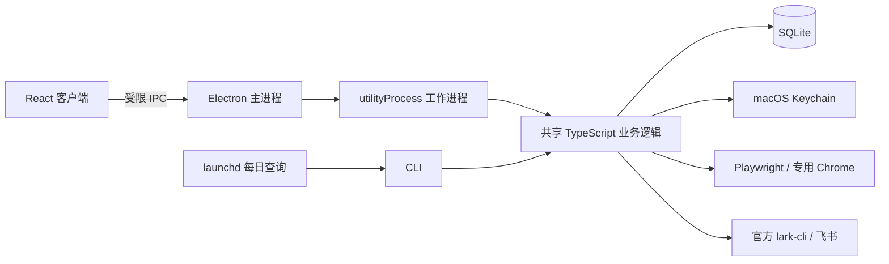

<div align="center">

  <h1>JobAgent</h1>
  <p><strong>把岗位、资料和申请进度放在一起的 macOS 个人网申助手</strong></p>

  <p>
    <a href="CHANGELOG.md"></a>
    <a href="#快速开始"></a>
    <a href="package.json"></a>
    <a href="LICENSE"></a>
  </p>

  <p>
    <a href="#核心功能">核心功能</a> ·
    <a href="#快速开始">快速开始</a> ·
    <a href="#架构概览">架构概览</a> ·
    <a href="#文档导航">使用文档</a> ·
    <a href="CONTRIBUTING.md">参与贡献</a> ·
    <a href="CHANGELOG.md">更新记录</a>
  </p>

</div>

面向 macOS 的本地个人网申工具。通过 Electron 客户端或 TypeScript CLI 管理岗位与资料，在专用 Chrome 中辅助填写申请、处理登录与资料补充、查询招聘进度，并将结果同步到飞书多维表格。

**辅助填写，人工审核，最终提交由本人在官网完成。** 客户端与 CLI 共用本地数据和业务逻辑，无需账号系统或自建服务。

## 为什么做 JobAgent

个人网申往往要反复整理简历、登录不同官网、填写相同资料，再把申请状态抄回表格。信息分散后，很难看清哪项申请需要补充资料、重新登录或继续跟进。

JobAgent 将这些步骤集中到一个本地工作台：用已确认的资料辅助填写，用任务详情提示下一项待办，用 SQLite 保留申请记录，再按需同步飞书。需要判断和确认的环节留给本人，在官网完成最终提交。

## 核心功能

**官网找岗位已接入工作台：** 腾讯社招、字节校招／实习可按关键词读取完整 JD，选择简历版本后进行本地条件筛选或 AI 对照。AI 调用前单独预览并确认资料披露；结果附 JD 与资料依据，由本人选择加入工作台。首版每站读取搜索首页前 3–10 条，详见[使用步骤与限制](docs/job-discovery.md)。

| 模块       | 能力                                                                                    |
| ---------- | --------------------------------------------------------------------------------------- |
| 投递工作台 | 导入 CSV / TSV / XLSX 岗位，搜索与筛选，查看招聘阶段、运行状态、待办和同步故障          |
| 辅助填写   | 使用 Playwright 管理专用 Chrome，复用字段规则，保留页面已有内容与人工修改               |
| 任务详情   | 实时事件、登录重新验证、资料补充、人工审核、安全暂停与恢复                              |
| 我的资料   | 导入文字版或扫描版 PDF / TXT / MD / JSON，本地 OCR、确认和冲突处理，资料值存入 Keychain |
| 进度跟踪   | 按站点规则读取官网申请记录，保留可靠阶段、查询时间与来源证据                            |
| 飞书同步   | 投递清单与状态看板模板，官方 `lark-cli` 同步、对账、失败重试和本地故障记录              |
| 设置与连接 | 检测 Chrome、飞书 CLI 和可选模型，配置数据目录及 launchd 每日查询                       |

当前版本为 **0.2.0**。已有本地自动化测试和 macOS arm64 打包验证；**尚无经过真实官网联调验证的招聘站点适配器**。通用填写可以从岗位 URL 启动，可靠的登录验证、进度查询和回执识别需要配置对应站点规则。未配置的能力会显示待配置或不支持。

## 快速开始

### 环境要求

- macOS；当前打包验收在 Apple Silicon 上完成。
- Node.js **24+** 与 npm。
- Google Chrome，用于可见浏览器中的登录与辅助填写。
- Apple Command Line Tools，用于从源码编译 Keychain 与本地 OCR 辅助程序；未安装时执行 `xcode-select --install`。
- 可选：飞书官方 `lark-cli` 与目标多维表格。模型 API 不属于必需依赖。

### 一键打开客户端

已有仓库时，在 Finder 中双击根目录的 **[启动客户端.command](启动客户端.command)** 即可。首次运行会显示构建终端，自动安装锁定依赖、构建本机 `.app` 并请求 macOS 打开；之后直接打开现有应用，不再每次编译。客户端打开后可以关闭该终端窗口。

首次获取项目也可以运行：

```bash
git clone https://github.com/xiaoyumuxi/personal-job-agent.git
cd personal-job-agent
npm start
```

`npm start` 与双击入口调用同一脚本。启动脚本会在常见的 Homebrew、nvm、Volta 和 mise 位置寻找 Node.js 24+ / npm；已有完整 `.app` 时无需依赖 Shell 中的 Node 环境。客户端读取现有业务数据，不自动导入测试岗位。

更新源码后，先在客户端按 `⌘Q` 退出，再运行 `npm run desktop:rebuild` 构建并打开新版。仅关闭窗口仍会保留客户端进程。可用 `./scripts/start-desktop.sh --check` 检查启动条件，不会安装依赖、构建或打开窗口。

开发时需要每次编译当前源码并查看终端日志，可使用原有入口：

```bash
npm ci
npm run desktop:dev
```

目前没有热更新开发服务器。若下载 ZIP 后 `.command` 缺少执行权限，可在仓库目录执行 `bash scripts/start-desktop.sh`；Git 克隆会保留脚本的执行权限。

### 第一次使用

1. **检测环境**：在“设置与连接”检查 Chrome 和数据目录。曾使用自定义 CLI 数据目录的用户，先选择“连接现有数据目录”。
2. **确认资料**：在“简历与资料”导入简历，检查解析结果，补全并确认各项资料。可参考 [资料模板](examples/profile.template.json)。
3. **导入岗位**：在“投递工作台”导入岗位文件。可参考 [表格格式](examples/jobs.csv)，导入本身不会启动申请。
4. **启动填写**：选择一个岗位和简历版本，核对目标网站和本次披露范围。登录、资料补充和暂停恢复均在独立任务工作区中处理。
5. **审核与提交**：前往官网核对表单，由本人点击最终提交，再返回客户端检查回执。本人自述提交与官网回执确认分别记录。
6. **跟踪与同步**：配置站点查询规则及飞书连接后，查询进度或同步飞书。每日查询需本人预览并安装 launchd 调度。

完整操作、窗口关闭与退出行为见 [客户端指南](docs/desktop.md)。

## 构建 macOS 应用

GitHub Actions 会在推送 `main`、版本标签和 PR 时分别构建 Apple Silicon 与 Intel App，运行类型、单元、浏览器及安装包测试。可从 [Build macOS App](https://github.com/xiaoyumuxi/personal-job-agent/actions/workflows/build-app.yml) 成功运行的 **Artifacts** 直接下载 DMG，双击后将 App 拖到“应用程序”；构建产物保留 14 天。触发方式、校验与下载说明见 [App CI 文档](docs/app-ci.md)。

```bash
npm run desktop:package
```

需要 DMG 安装包时运行 `npm run desktop:dmg`，输出到 `release/artifacts/JobAgent-macOS-<架构>.dmg`。

按本机架构输出应用：

```text
release/JobAgent-darwin-arm64/JobAgent.app  # Apple Silicon
release/JobAgent-darwin-x64/JobAgent.app    # Intel，尚未实机验收
```

构建产物包含独立 Node 运行时、Keychain 与本地 OCR 辅助程序；日常使用不需要打开终端。Chrome 和飞书 CLI 仍为外部依赖。打开设置页会自动查找、验证并保存飞书 CLI 的绝对路径（含 Homebrew、nvm 安装），也支持重新查找和手动选择；本机程序可用与飞书授权、目标表权限分别展示。

源码构建和 CI 产物目前均没有 Developer ID 签名、Apple 公证或自动更新。打包应用在隔离测试目录下通过了启动验证；Finder 的常规打开流程仍未完成验收。构建资源与验证范围见 [客户端文档](docs/desktop.md) 和 [桌面验收记录](docs/desktop-verification.md)。

## CLI 使用

CLI 与客户端调用同一份核心逻辑，可以按需交替使用。

```bash
# 初始化与环境检测
npm run dev -- init
npm run dev -- doctor

# 导入资料和岗位
npm run dev -- profile import /absolute/path/resume.pdf
npm run dev -- profile confirm
npm run dev -- jobs import /absolute/path/jobs.xlsx
npm run dev -- jobs list

# 将 JOB_ID 替换为岗位列表中的真实 ID
npm run dev -- apply JOB_ID

# 查询进度、同步飞书、查看本地状态
npm run dev -- track
npm run dev -- sync
npm run dev -- status
```

运行 `npm run dev -- --help` 查看命令。构建后也可使用 `node dist/src/cli.js <命令>`，无需全局安装。站点配置、字段映射、手动恢复及调度命令见 [CLI 使用指南](docs/cli.md)。

## 配置与数据

默认业务数据目录为 `~/Library/Application Support/JobAgent`：

```text
JobAgent/
├── config.json       非敏感配置
├── state.sqlite      岗位、申请、任务、事件与同步记录
├── chrome-profile/   应用专用 Chrome 资料目录
├── attachments/      导入的简历附件
├── logs/             launchd 日志
└── status.json       本地异常报告
```

CLI 支持 `--home <目录>` 或 `JOBAGENT_HOME`。客户端支持连接已有数据目录，不会因 Electron 的 `userData` 目录而创建第二套业务数据库；环境变量的优先级和已有调度的目录行为见 [数据位置说明](docs/desktop.md#数据位置)。

| 配置项   | 入口与说明                                                                                                 |
| -------- | ---------------------------------------------------------------------------------------------------------- |
| 站点规则 | 客户端导入规则文件，或设置 `config.json` 中的 `siteFiles`；参考 [站点配置样例](sites/generic.example.json) |
| 字段映射 | 优先使用明确站点规则和已确认映射；参考 [通用映射](examples/field-mappings.json)                            |
| 飞书     | 保存并验证官方 CLI 路径，完成授权，连接真实 Base token / Table ID；见 [飞书配置](docs/feishu.md)           |
| 模型     | 可选的 OpenAI 兼容 HTTPS 接口，仅用于字段语义建议；未配置时仍可规则填写和人工补充                          |
| 每日查询 | 使用 launchd，时区跟随 macOS；安装前展示影响，打开客户端不会自动安装                                       |

## 隐私与操作边界

- 资料值、补充答案和模型密钥使用 macOS Keychain；简历附件保存在受限权限的本地目录。Keychain 失败时不会降级为明文保存。
- 登录状态由专用 Chrome 资料目录管理，不接管日常 Chrome，不提供 Cookie 导入导出。
- 客户端渲染进程启用沙箱和上下文隔离，仅通过有限的业务 IPC 调用后端；不开放任意 Shell、文件读取或 JavaScript 执行。
- 填写和上传可能向招聘网站发送资料，执行前需要本人核对披露范围。模型语义请求不包含个人资料值、简历正文或认证数据。
- 不提供自动批量投递或自动最终提交。批量查询只用于读取进度；结果未知时阻止盲目重复申请。
- 客户端、CLI 和 launchd 共用跨进程锁。暂停在安全操作边界生效，已发出的网页操作无法撤回。
- 飞书同步失败会保留本地故障。工作台的异常颜色不代表远端表格已经更新。

## 架构概览

Electron 客户端负责界面与交互，长任务在工作进程中执行。客户端和 CLI 复用 `src/` 中的业务函数；launchd 调用原 CLI，三种入口使用同一数据目录与跨进程锁。



浏览器登录继续由 Chrome 管理，敏感资料由 Keychain 管理。客户端不解析终端输出，也不另建 HTTP 服务或第二套任务状态机。协议与安全实现见 [客户端指南](docs/desktop.md#交互协议与安全边界)。

## 开发与测试

```bash
npm run typecheck          # TypeScript 类型检查
npm test                   # 核心业务与应用服务测试
npm run test:browser       # 本地 Chrome 表单回归
npm run desktop:build      # 构建 CLI、Electron 与渲染资源
npm run test:desktop       # Electron 客户端冒烟测试

# 包含本机构建产物的验收
npm run desktop:package
JOBAGENT_TEST_PACKAGE=1 npm run test:desktop
```

浏览器测试使用本机 Google Chrome 和临时专用资料目录。桌面测试使用隔离数据与明确的测试替身，不会向真实企业发送测试申请。手动体验测试表单可运行 `npm run fixture` 和 `npm run fixture:seed`，详见 [本地体验指南](docs/cli.md#本地体验与验证)。

最近一次验收：单元与服务测试 **53/53**（含 10 项启动脚本测试）、浏览器回归 **18/18**、含打包启动、真实扫描 PDF OCR 与经历编辑/绑定的客户端测试 **5/5**。这些是实际执行记录，不是持续集成状态；执行条件及未验证项见 [基础验证记录](docs/verification.md) 与 [桌面验收记录](docs/desktop-verification.md)。

<details>
<summary><strong>项目结构</strong></summary>

```text
desktop/           Electron 主进程、preload、工作进程与 React 界面
src/
├── application/   共享应用服务、任务运行时与结构化事件
├── browser/       Chrome 会话、页面观察与辅助填写
├── feishu/        官方 CLI 接入、字段映射与同步
├── cli.ts         命令行入口
├── db.ts          SQLite 数据访问
├── profile.ts     资料管理
└── schedule.ts    launchd 调度
scripts/           客户端构建与 macOS 打包
sites/             站点规则样例
examples/          配置、岗位与资料模板
fixtures/          显式本地测试站点
tests/             业务、浏览器与桌面测试
docs/              使用说明与验收记录
```

</details>

## 当前限制

- 文字较少的 PDF 页面自动使用 macOS Vision 本地 OCR，支持中英文；每份 PDF 最大 20 MB，一次最多识别 20 个扫描页。无需模型 API，PDF 和识别图片不上传云端。
- 自动拆分教育、工作/实习和项目经历，保留日期精度、描述及识别依据；所有候选值需要本人确认。复杂多栏、无章节标题或模糊扫描仍可能需要补充，未明确标注的角色和学位不会推断。详见 [经历解析与网申映射](docs/resume-mapping.md)。
- 自定义复杂控件、Shadow DOM 和不明确的页面行为需要人工接管，不能保证任意招聘网站自动填写完整。
- 真实招聘站点联调、真实飞书授权及写入、真实模型端点、实际 launchd 安装执行尚未完成生产验证。
- 没有账号系统、云端服务、插件市场、自动更新或自动最终提交功能。

## 文档导航

| 文档                                       | 内容                                                 |
| ------------------------------------------ | ---------------------------------------------------- |
| [客户端指南](docs/desktop.md)              | 日常操作、登录接管、资料补充、窗口生命周期与打包说明 |
| [CLI 指南](docs/cli.md)                    | 全部主要命令、站点规则、字段映射与恢复操作           |
| [飞书配置](docs/feishu.md)                 | 官方 CLI 授权、目标表字段、同步及异常颜色            |
| [投递跟踪模板](docs/feishu-template.md)    | 七列投递清单、彩色状态、三个视图与旧表兼容           |
| [客户端验收](docs/desktop-verification.md) | 桌面测试场景、打包结果与未验证范围                   |
| [基础验收](docs/verification.md)           | CLI、字段匹配、浏览器与同步的验证记录                |
| [贡献指南](CONTRIBUTING.md)                | 开发准备、代码边界、测试选择与提交方式               |
| [更新记录](CHANGELOG.md)                   | 源码版本与主要改动                                   |

## 参与贡献

欢迎贡献问题反馈、文档修正、站点规则和代码改进。开始前请阅读 [贡献指南](CONTRIBUTING.md)。

- [报告问题](https://github.com/xiaoyumuxi/personal-job-agent/issues/new?template=bug_report.yml)：提供复现步骤、环境和脱敏错误。
- [提出建议](https://github.com/xiaoyumuxi/personal-job-agent/issues/new?template=feature_request.yml)：说明使用场景与期望结果。
- [提交 Pull Request](https://github.com/xiaoyumuxi/personal-job-agent/pulls)：说明改动原因、实际验证结果和未验证范围。

## 致谢

项目基于 Electron、React、Playwright 和 SQLite 构建，通过飞书官方 CLI 接入多维表格。README 的信息组织参考了 [Lithe](https://github.com/1lck/Lithe-IDEA) 的项目介绍、安装、架构与开发文档结构。

## 许可证

本项目采用 [ISC License](LICENSE)，与 `package.json` 中的声明一致。

Copyright (c) 2026 xiaoyumuxi。第三方依赖各自遵循其许可证。

多份简历可分别保存和命名，在每个岗位启动填写前选择对应版本；见[多版本简历说明](docs/resume-versions.md)。
